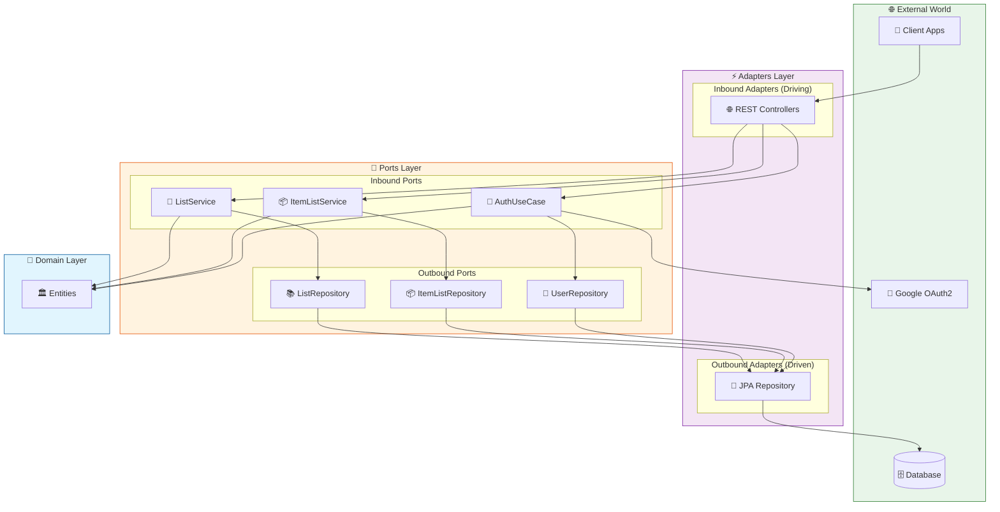
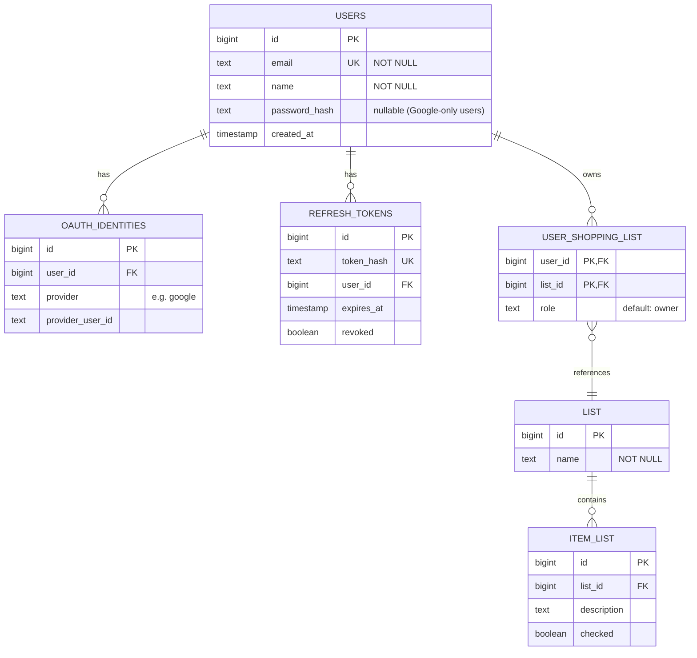

# 🛒 Lista-AI


[](https://codecov.io/gh/tsantanadev/lista-ai)

A modern Shopping List REST API built with **Java 25** and **Spring Boot**, following **Hexagonal Architecture** principles.

## 📋 Table of Contents

- [Overview](#overview)
- [Architecture](#architecture)
- [Authentication](#authentication)
- [Database Schema](#database-schema)
- [Tech Stack](#tech-stack)
- [Getting Started](#getting-started)
- [API Endpoints](#api-endpoints)
- [Project Structure](#project-structure)

## Overview

Lista-AI is a RESTful API designed to manage shopping lists and their items. It provides a clean and intuitive interface for creating, updating, and organizing your shopping needs.

### Features

- ✅ Create and manage multiple shopping lists (per-user ownership)
- ✅ Add, update, and remove items from lists
- ✅ Mark items as checked/unchecked
- ✅ Email/password registration and login
- ✅ Google OAuth2 sign-in
- ✅ JWT access tokens + rotating opaque refresh tokens
- ✅ RESTful API design with OpenAPI documentation
- ✅ Clean Architecture with Hexagonal design patterns

## Architecture

This project follows **Hexagonal Architecture** (also known as Ports and Adapters), which promotes separation of concerns and makes the application highly testable and maintainable.



### Architecture Layers

| Layer | Description |
|-------|-------------|
| **Domain** | Contains business entities as Java records, with zero external dependencies. |
| **Ports** | Defines interfaces (ports) for inbound (use cases) and outbound (repositories) operations. |
| **Adapters** | Implements the ports. Inbound adapters handle external requests (REST), while outbound adapters handle persistence. |

### Key Benefits

- 🧪 **Testability**: Business logic can be tested without infrastructure concerns
- 🔄 **Flexibility**: Easy to swap implementations (e.g., change database)
- 📦 **Modularity**: Clear separation between layers
- 🛡️ **Domain Protection**: Business rules are isolated and protected

## Authentication

The API uses a stateless JWT-based authentication scheme.

### How it works

1. **Register or login** via `/v1/auth/register`, `/v1/auth/login`, or `/v1/auth/google` to receive an access token and a refresh token.
2. **Include the access token** as a `Bearer` token in the `Authorization` header for all protected endpoints.
3. **Refresh the access token** via `/v1/auth/refresh` before it expires (15 minutes). The old refresh token is revoked and a new one is issued (token rotation).
4. **Logout** via `/v1/auth/logout` to revoke the refresh token.

### Token details

| Token | Type | Algorithm | Lifetime |
|-------|------|-----------|----------|
| Access token | JWT | HS256 | 15 minutes |
| Refresh token | Opaque (SHA-256 hashed at rest) | — | 7 days |

### Configuration

| Environment variable | Description |
|----------------------|-------------|
| `JWT_SECRET` | **Required.** Base64-encoded 256-bit secret for signing JWTs. |
| `GOOGLE_CLIENT_ID` | Google OAuth2 client ID for validating Google ID tokens. |

## Database Schema

The application uses a relational database with the following entity-relationship model:



## Tech Stack

| Technology | Purpose |
|------------|---------|
| **Java 25** | Primary programming language |
| **Spring Boot 4.x** | Application framework |
| **Spring Security 6** | Authentication & authorization |
| **Spring Security OAuth2 Resource Server** | JWT validation |
| **Nimbus JOSE JWT** | JWT generation (HS256) and Google ID token validation (RS256) |
| **Spring Data JPA** | Data persistence |
| **MapStruct 1.6** | Compile-time object mapping |
| **PostgreSQL** | Relational database |
| **Liquibase** | Database schema migrations |
| **Gradle (Kotlin DSL)** | Build tool |
| **OpenAPI 3.0** | API documentation |

## Getting Started

### Prerequisites

- JDK 25 or higher
- Docker (for PostgreSQL)

### Running the Application

```bash
# Start PostgreSQL
docker-compose up -d

# Run with Gradle (JWT_SECRET is required)
JWT_SECRET=<base64-encoded-256-bit-secret> ./gradlew bootRun

# Or build and run the JAR
./gradlew build
JWT_SECRET=<base64-encoded-256-bit-secret> java -jar build/libs/lista-ai-*.jar
```

To generate a suitable secret:

```bash
openssl rand -base64 32
```

## API Endpoints

### Authentication

| Method | Endpoint | Description |
|--------|----------|-------------|
| `POST` | `/v1/auth/register` | Register with email + password → returns token pair (201) |
| `POST` | `/v1/auth/login` | Login with email + password → returns token pair |
| `POST` | `/v1/auth/google` | Sign in with Google ID token → returns token pair |
| `POST` | `/v1/auth/refresh` | Exchange refresh token for new token pair |
| `POST` | `/v1/auth/logout` | Revoke refresh token |

All protected endpoints require `Authorization: Bearer <access-token>`.

### Shopping Lists

| Method | Endpoint | Description |
|--------|----------|-------------|
| `GET` | `/v1/lists` | Get all shopping lists owned by the authenticated user |
| `POST` | `/v1/lists` | Create a new shopping list |
| `DELETE` | `/v1/lists/{listId}` | Delete a shopping list |

### Shopping List Items

| Method | Endpoint | Description |
|--------|----------|-------------|
| `GET` | `/v1/lists/{listId}/items` | List all items in a shopping list |
| `POST` | `/v1/lists/{listId}/items` | Add an item to a shopping list |
| `PUT` | `/v1/lists/{listId}/items/{itemId}` | Update an item |
| `DELETE` | `/v1/lists/{listId}/items/{itemId}` | Delete an item |

> 📖 Full API documentation available at `http://localhost:8080/swagger-ui/index.html` when the application is running.

## Project Structure

```
lista-ai/
├── src/main/java/com/listaai/
│   ├── domain/                    # 💎 Domain Layer
│   │   └── model/                 # Java records: ShoppingList, ItemList, User, OAuthIdentity
│   │
│   ├── application/               # 🔌 Application Layer (Ports)
│   │   ├── port/
│   │   │   ├── input/             # Inbound Ports: ListService, ItemListService, AuthUseCase + commands
│   │   │   └── output/            # Outbound Ports: ListRepository, UserRepository, RefreshTokenRepository, etc.
│   │   └── service/               # Use Case Implementations + auth providers (Local, Google)
│   │
│   └── infrastructure/            # ⚡ Infrastructure Layer (Adapters)
│       ├── adapter/
│       │   ├── input/rest/        # REST Controllers, DTOs (records), MapStruct mappers
│       │   └── output/persistence/ # JPA entities, Spring Data repos, MapStruct mappers, adapters
│       └── security/              # SecurityConfig, JwtTokenService, AuthEntryPoint, SecurityBeans
│
├── src/main/resources/
│   ├── application.yaml
│   └── db/changelog/              # Liquibase migrations (001–006)
│
└── build.gradle.kts
```

## License

This project is licensed under the MIT License - see the [LICENSE](LICENSE) file for details.
