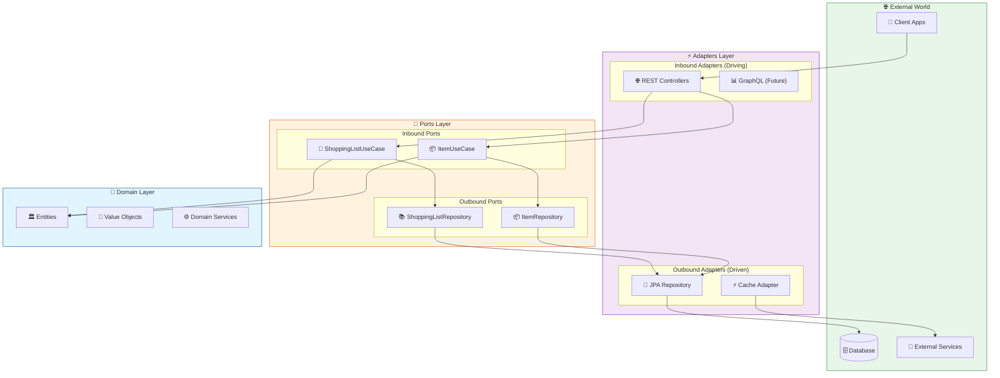
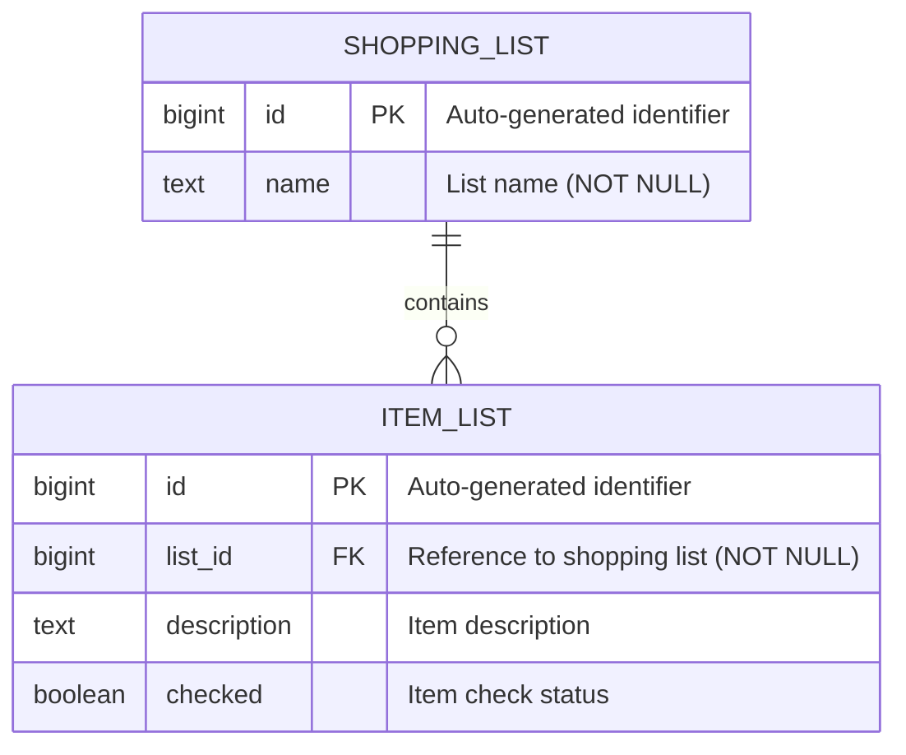

# 🛒 Lista-AI

A modern Shopping List REST API built with **Java 25** and **Spring Boot**, following **Hexagonal Architecture** principles.

## 📋 Table of Contents

- [Overview](#overview)
- [Architecture](#architecture)
- [Database Schema](#database-schema)
- [Tech Stack](#tech-stack)
- [Getting Started](#getting-started)
- [API Endpoints](#api-endpoints)
- [Project Structure](#project-structure)

## Overview

Lista-AI is a RESTful API designed to manage shopping lists and their items. It provides a clean and intuitive interface for creating, updating, and organizing your shopping needs.

### Features

- ✅ Create and manage multiple shopping lists
- ✅ Add, update, and remove items from lists
- ✅ Mark items as checked/unchecked
- ✅ RESTful API design with OpenAPI documentation
- ✅ Clean Architecture with Hexagonal design patterns

## Architecture

This project follows **Hexagonal Architecture** (also known as Ports and Adapters), which promotes separation of concerns and makes the application highly testable and maintainable.



### Architecture Layers

| Layer | Description |
|-------|-------------|
| **Domain** | Contains business entities as Java records, with zero external dependencies. |
| **Ports** | Defines interfaces (ports) for inbound (use cases) and outbound (repositories) operations. |
| **Adapters** | Implements the ports. Inbound adapters handle external requests (REST), while outbound adapters handle persistence. |

### Key Benefits

- 🧪 **Testability**: Business logic can be tested without infrastructure concerns
- 🔄 **Flexibility**: Easy to swap implementations (e.g., change database)
- 📦 **Modularity**: Clear separation between layers
- 🛡️ **Domain Protection**: Business rules are isolated and protected

## Database Schema

The application uses a relational database with the following entity-relationship model:



### Relationships

| Relationship | Description |
|--------------|-------------|
| `SHOPPING_LIST` → `ITEM_LIST` | One-to-Many: A shopping list can contain multiple items |
| `ITEM_LIST` → `SHOPPING_LIST` | Many-to-One: Each item belongs to exactly one shopping list |

### Cascade Behavior

- When a `SHOPPING_LIST` is deleted, all associated `ITEM_LIST` records are also deleted (CASCADE DELETE)

## Tech Stack

| Technology | Purpose |
|------------|---------|
| **Java 25** | Primary programming language |
| **Spring Boot 4.x** | Application framework |
| **Spring Data JPA** | Data persistence |
| **MapStruct 1.6** | Compile-time object mapping |
| **PostgreSQL** | Relational database |
| **Liquibase** | Database schema migrations |
| **Gradle (Kotlin DSL)** | Build tool |
| **OpenAPI 3.0** | API documentation |

## Getting Started

### Prerequisites

- JDK 25 or higher
- Docker (for PostgreSQL)

### Running the Application

```bash
# Start PostgreSQL
docker-compose up -d

# Run with Gradle
./gradlew bootRun

# Or build and run the JAR
./gradlew build
java -jar build/libs/lista-ai-*.jar
```

## API Endpoints

### Shopping Lists

| Method | Endpoint | Description |
|--------|----------|-------------|
| `GET` | `/v1/lists` | Get all shopping lists |
| `POST` | `/v1/lists` | Create a new shopping list |
| `DELETE` | `/v1/lists/{listId}` | Delete a shopping list |

### Shopping List Items

| Method | Endpoint | Description |
|--------|----------|-------------|
| `GET` | `/v1/lists/{listId}/items` | List all items in a shopping list |
| `POST` | `/v1/lists/{listId}/items` | Add an item to a shopping list |
| `PUT` | `/v1/lists/{listId}/items/{itemId}` | Update an item |
| `DELETE` | `/v1/lists/{listId}/items/{itemId}` | Delete an item |

> 📖 Full API documentation available at `/swagger-ui.html` when the application is running.

## Project Structure

```
lista-ai/
├── src/main/java/com/listaai/
│   ├── domain/                    # 💎 Domain Layer
│   │   └── model/                 # Java records: ShoppingList, ItemList
│   │
│   ├── application/               # 🔌 Application Layer (Ports)
│   │   ├── port/
│   │   │   ├── input/             # Inbound Ports (Use Cases) + command records
│   │   │   └── output/            # Outbound Ports (Repositories)
│   │   └── service/               # Use Case Implementations
│   │
│   └── infrastructure/            # ⚡ Infrastructure Layer (Adapters)
│       └── adapter/
│           ├── input/rest/        # REST Controllers, DTOs (records), MapStruct mappers
│           └── output/persistence/ # JPA entities, Spring Data repos, MapStruct mappers, adapters
│
├── src/main/resources/
│   ├── application.yaml
│   └── db/changelog/              # Liquibase migrations
│
└── build.gradle.kts
```

## License

This project is licensed under the MIT License - see the [LICENSE](LICENSE) file for details.
